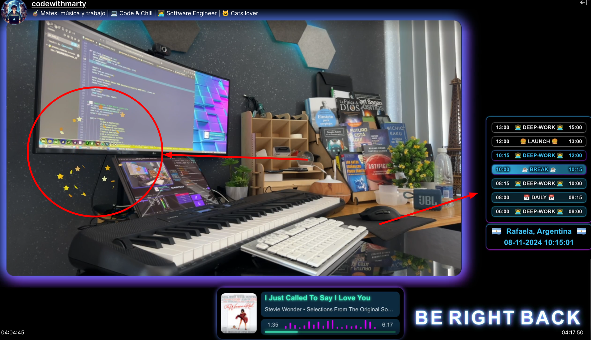
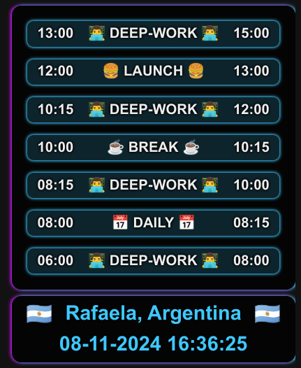

# 🎉 Schedule Overlay - Web-based Overlay for Productivity Tracking

Welcome! This is the repository for the **Schedule Overlay**, an interactive website that displays a schedule of activities designed to boost productivity and aid in time management. 🎯

## 🌎 Live Demo

If you want to see the overlay in action, click here: [Live Demo](https://comfy-treacle-385af3.netlify.app/)

---




## ✨ Features

-   **Visual Schedule Interface**: Displays a visual timeline with activity segments such as _Deep Work_, _Break_, and _Lunch_.
-   **Celebration Effects**: When a segment ends, the site launches confetti 🎊 to motivate you and mark the activity change.
-   **Integrated Alarm**: At the end of each segment, an alarm sounds to notify you it's time to switch tasks.
-   **Current Location and Time**: Shows the current time and location (like Rafaela, Argentina) to keep you aware of the time.

## 🛠 Technologies Used

-    **Vite**: Fast and optimized development server and build tool for modern web projects.
-    **Vue 3**: JavaScript framework for building user interfaces with a component-based architecture.
-    **TypeScript**: Strongly typed programming language that builds on JavaScript, providing better tooling and error-checking.
-   **HTML5** and **CSS3**: Structure and styling of the site.
-   **JavaScript**: Manages additional logic for time control, alarm, and confetti effects.
-   **Libraries**:
    -   [Canvas Confetti](https://github.com/catdad/canvas-confetti#readme) for confetti animation 🎉.

## 🚀 How to Use

1. **Clone the repository**:
    ```bash
    git clone https://github.com/LucasJappert/twitch-extensions.git
    ```
2. **Navigate to the project folder**:
    ```bash
    cd twitch-extensions
    ```
3. **Install the dependencies**:
    ```bash
    npm install
    ```
4. **Run the development server**:
    ```bash
    npm run dev
    ```
5. **Open the `src/views/twitch/utils/schedule.utils.ts` file** to customize the schedule.

## 🎛 Customization

## 🖼 Sample Usage

Below is an example of a typical schedule:

| Time  | Activity     |
| ----- | ------------ |
| 06:00 | 🧑‍💻 DEEP-WORK |
| 08:00 | 🗓 DAILY      |
| 08:15 | 🧑‍💻 DEEP-WORK |
| 10:00 | ☕ BREAK     |
| 10:15 | 🧑‍💻 DEEP-WORK |
| 12:00 | 🍔 LUNCH     |
| 13:00 | 🧑‍💻 DEEP-WORK |

---

## 🤝 Contributions

Contributions are welcome! If you have ideas to improve this overlay, feel free to fork the repository, make changes, and [create a pull request](https://github.com/LucasJappert/twitch-extensions/pulls).

### How to Contribute

1. **Fork this repository** by clicking the "Fork" button at the top right of this page.
2. **Clone your forked repository** to your local machine:
    ```bash
    git clone https://github.com/your-username/twitch-extensions.git
    ```
3. **Create a new branch** for your feature or bug fix:
    ```bash
    git checkout -b feature/YourFeatureName
    ```
4. **Make your changes** and commit them:
    ```bash
    git commit -m "Add your message here"
    ```
5. **Push your branch** to GitHub:
    ```bash
    git push origin feature/YourFeatureName
    ```
6. Finally, [open a pull request](https://github.com/LucasJappert/twitch-extensions/compare) to discuss your changes.

---

Thank you for contributing! 🚀

## 📝 License

This project is licensed under the MIT License. You are free to use the code as long as the attribution is maintained.

---

Thank you for checking out this project! I hope it helps improve your productivity and time management. 🚀
